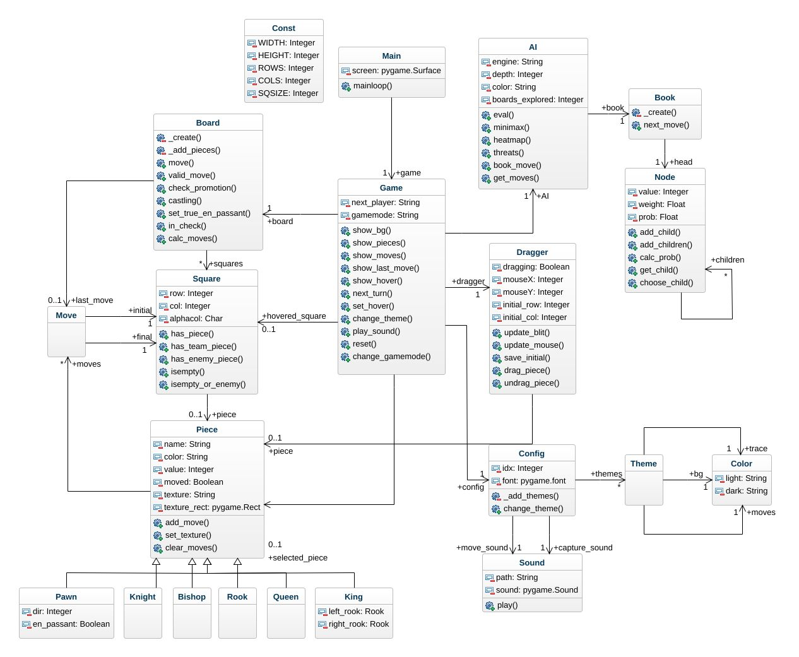

# WIP: AI Chess
Working on AI gamemode and debuging!

The demonstration of the classdiagram of the chess game! 

Instructions
- Entry point: main.py
- Press 't' to change theme.
- Press 'r' to restart the game.

# Some Visual Captures

## Start State (green board)

## Valid Moves or States

## Castling 

